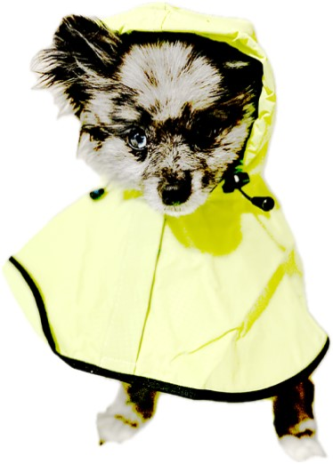

# CalmDownSpike

CalmDownSpike is an innovative interactive dog blanket designed to offer comfort and alleviate anxiety in dogs. It aims to provide dog owners convenience and peace of mind. CalmDownSpike is designed for pet owners who want practical solutions to help their dogs manage anxiety and stress. It includes many features, such as configurable settings, remote management through a mobile app, and revolutionary technology that creates a soothing dog environment. CalmDownSpike strives to enhance the welfare and overall quality of life for pets and their families by catering to the requirements of both dogs and their owners.

## Target Audience

- **Pet Owners**: Those looking for ways to assist their dogs cope with separation anxiety, loud noises, and other stressors.
- **Dog Lovers**: Individuals who appreciate the necessity of providing a safe and reassuring atmosphere for needy canines.
- **Veterinary Professionals**: Veterinarians, animal behaviorists, and other veterinary professionals who can prescribe CalmDownSpike to worried dog owners.
- **Busy Pet Owners**: Owners who may not always be able to calm and reassure their canines but want peace of mind through remote control capabilities.

## Features

- Calming and soothing sounds
- Temperature settings for comfort
- LED lights for calming
- Customizable voice activation
- Remote management through a mobile app
- User account management
- Customizable blanket settings (sound, temperature, light, vibration)
- Automated control features
- Safety measures (monitoring, movement detection)